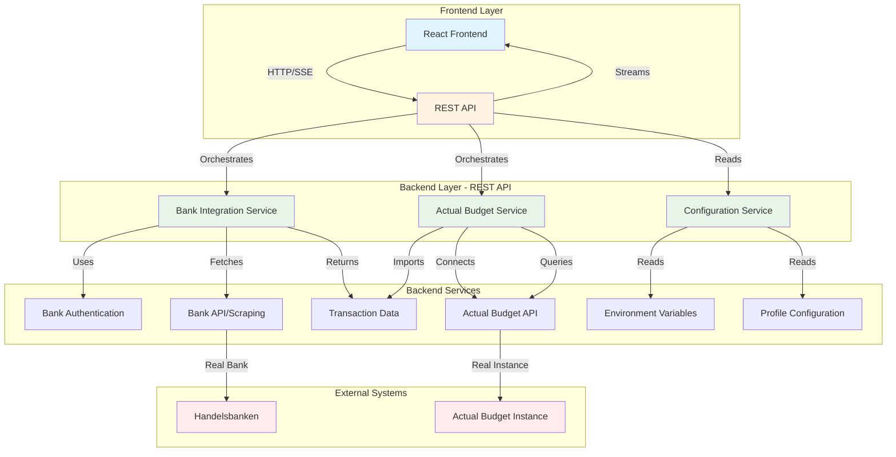
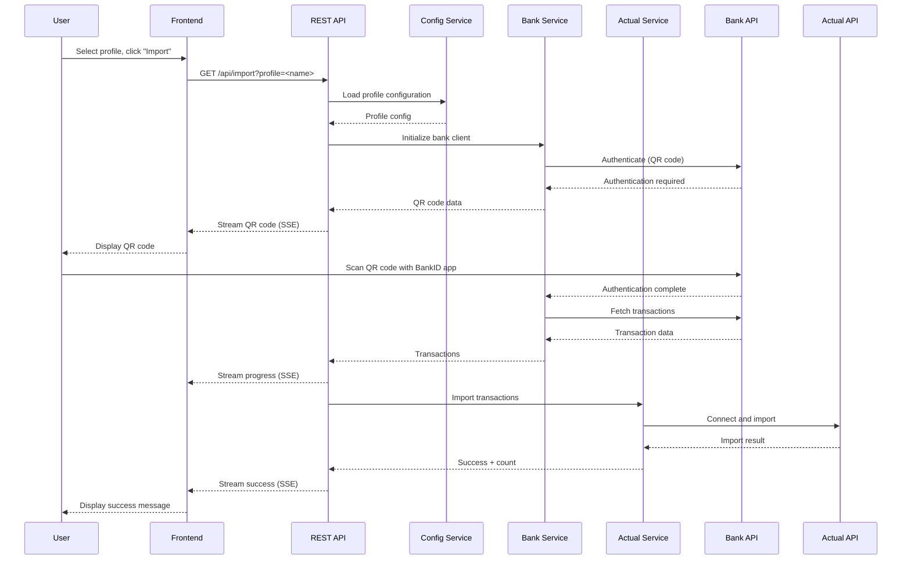

# Target Architecture

## Overview

This document describes the target architecture for the AB Transaction Importer application. The goal is to merge the CLI tool functionality into a service-oriented backend architecture, separating concerns into distinct services that can be independently tested, maintained, and extended.

---

## Architecture Diagram



---

## Component Descriptions

### 1. Frontend (React Application)

**Purpose:** User interface for initiating imports, viewing status, and handling authentication.

**Responsibilities:**
- Display available profiles
- Allow user to select profile and initiate import
- Display QR codes for bank authentication (BankID)
- Show real-time import progress via SSE
- Display success/error messages and transaction counts
- Handle user input for authentication

**Technology:** React 19, Vite

**Location:** `frontend/`

---

### 2. REST API (Express.js Server)

**Purpose:** Communication layer between frontend and backend services. Handles HTTP requests, orchestrates services, and streams responses.

**Responsibilities:**
- Receive HTTP requests from frontend
- Validate requests and parameters
- Orchestrate service calls (Bank Integration → Actual Budget)
- Stream real-time updates via Server-Sent Events (SSE)
- Handle errors and format responses
- Manage request lifecycle and cleanup

**Key Endpoints:**
- `GET /api/profiles` - List available profiles
- `GET /api/import?profile=<name>` - Start import (SSE stream)
- `GET /api/accounts` - List Actual Budget accounts
- `GET /api/health` - Health check

**Technology:** Express.js 5, Server-Sent Events

**Location:** `backend/api/` (to be created)

---

### 3. Bank Integration Service

**Purpose:** Handles all bank-specific operations including authentication and transaction fetching.

**Responsibilities:**
- Initialize bank client based on profile configuration
- Handle bank authentication (e.g., BankID QR codes for Handelsbanken)
- Fetch transactions from bank APIs or web scraping
- Transform bank-specific transaction formats to standard format
- Provide authentication status and QR codes for frontend display
- Support mocking for testing (avoid spamming banks)
- Log bank API changes and alert on failures
- Validate transactions before returning

**Key Features:**
- **Mockable:** Can be mocked to avoid hitting real banks during testing
- **Testable:** Well-documented, easily testable integration points
- **Observable:** Logs authentication flows, API changes, errors
- **Extensible:** Registry pattern for adding new banks

**Current Source:** `ab-trx-importer/src/banks/` and `ab-trx-importer/src/core/bank-client.ts`

**Target Location:** `backend/services/bank-integration/`

**Dependencies:**
- Playwright (for web scraping)
- Bank-specific authentication libraries

---

### 4. Actual Budget Service

**Purpose:** Handles all interactions with the Actual Budget instance.

**Responsibilities:**
- Connect to configured Actual Budget instance
- Query for existing transactions (smart date detection)
- Import transactions into specified account
- Support dry-run mode (preview without importing)
- Handle deduplication
- Validate transaction format before import
- Manage connection lifecycle

**Key Features:**
- **Dry-run support:** Preview transactions without importing
- **Smart date detection:** Finds latest transaction to avoid duplicates
- **Deduplication:** Prevents duplicate imports
- **Testable:** Can be tested with mock Actual Budget instances

**Current Source:** `ab-trx-importer/src/core/actual-budget-connector.ts`

**Target Location:** `backend/services/actual-budget/`

**Dependencies:**
- `@actual-app/api`

---

### 5. Configuration Service

**Purpose:** Manages all configuration including environment variables, profiles, and application settings.

**Responsibilities:**
- Load and validate environment variables (.env)
- Load and validate profile configurations (profiles.json)
- Provide configuration to other services
- Validate configuration completeness
- Handle configuration errors gracefully

**Configuration Sources:**
- **Environment Variables:** Actual Budget connection (server URL, password, sync ID, encryption key)
- **Profile Files:** Bank account mappings, bank-specific parameters, Actual Budget account IDs

**Current Source:** `ab-trx-importer/src/config/user-config.ts`

**Target Location:** `backend/services/configuration/`

---

## Data Flow

### Import Flow



---

## Service Communication Patterns

### Synchronous Calls
- REST API → Configuration Service (read-only, fast)
- REST API → Bank Service (initialization, validation)

### Asynchronous/Streaming
- REST API → Frontend (SSE for real-time updates)
- Bank Service → REST API (authentication status, QR codes)
- Bank Service → REST API (transaction fetching progress)

### Event-Driven (Future)
- Services can emit events for cross-cutting concerns (logging, monitoring)
- Event bus for decoupled service communication

---

## Testing Strategy

### Bank Integration Service
- **Unit Tests:** Mock Playwright, test transaction parsing
- **Integration Tests:** Mock bank APIs, test authentication flows
- **Mock Mode:** Full mock implementation to avoid hitting real banks
- **Contract Tests:** Verify bank API changes don't break integration

### Actual Budget Service
- **Unit Tests:** Mock Actual Budget API
- **Integration Tests:** Test with test Actual Budget instance
- **Dry-run Mode:** Test import logic without actual import

### Configuration Service
- **Unit Tests:** Test configuration loading and validation
- **Integration Tests:** Test with various configuration scenarios

### REST API
- **Integration Tests:** Test full flow with mocked services
- **E2E Tests:** Test with real services (staging environment)

---

## Error Handling

### Service-Level Errors
- Each service handles its own errors and returns structured error responses
- Services log errors with context for debugging

### API-Level Errors
- REST API catches service errors and formats appropriate HTTP responses
- Streams error messages to frontend via SSE
- Maintains error context for debugging

### Frontend Errors
- Displays user-friendly error messages
- Shows technical details in development mode
- Handles connection errors gracefully

---

## Security Considerations

### Current (POC Phase)
- Local network only
- No authentication required

### Future (Production)
- Authentication for API access
- Secure storage of credentials
- Encrypted communication
- Rate limiting
- Input validation and sanitization

---

## Deployment Architecture

### Development
- Frontend: Vite dev server (port 5173)
- Backend: Node.js with Express (port 8000)
- Services: In-process Node.js modules

### Production (Target: Home Assistant Add-on)
- Single Docker container
- Frontend: Static files served by Express
- Backend: Express API + Services
- All services in same process (for simplicity)

### Future (Scalable)
- Services could be separate containers
- Message queue for async operations
- Database for import history
- Redis for caching

---

## Migration Benefits

1. **Better Separation of Concerns:** Each service has a single responsibility
2. **Easier Testing:** Services can be mocked and tested independently
3. **Better Maintainability:** Changes to one service don't affect others
4. **Extensibility:** Easy to add new banks or features
5. **No CLI Dependency:** Direct service calls instead of spawning processes
6. **Better Error Handling:** Structured error responses instead of parsing CLI output
7. **Real-time Updates:** Native streaming instead of process output capture
8. **Type Safety:** TypeScript throughout, better IDE support

---

## File Structure (Target)

```
ab-trx-importer-frontend/
├── frontend/                    # React frontend
│   ├── src/
│   │   ├── components/
│   │   ├── services/           # API client
│   │   └── utils/
│   └── ...
├── backend/
│   ├── api/                    # REST API layer
│   │   ├── routes/
│   │   ├── middleware/
│   │   └── server.js
│   ├── services/               # Business logic services
│   │   ├── bank-integration/   # Bank Integration Service
│   │   │   ├── banks/
│   │   │   │   └── handelsbanken/
│   │   │   ├── bank-client.ts
│   │   │   └── index.ts
│   │   ├── actual-budget/      # Actual Budget Service
│   │   │   ├── connector.ts
│   │   │   └── index.ts
│   │   └── configuration/     # Configuration Service
│   │       ├── config-loader.ts
│   │       └── index.ts
│   └── shared/                 # Shared utilities
│       ├── types/
│       ├── logger/
│       └── utils/
└── ...
```

---

## Next Steps

See [MIGRATION-PLAN.md](./MIGRATION-PLAN.md) for detailed migration steps.

